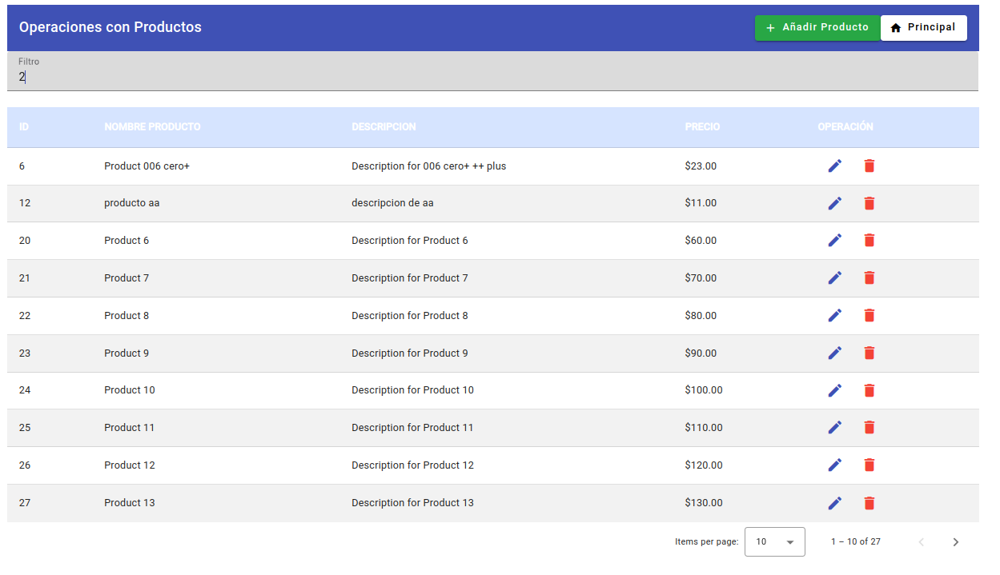
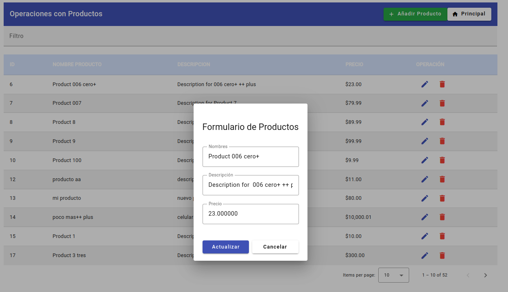
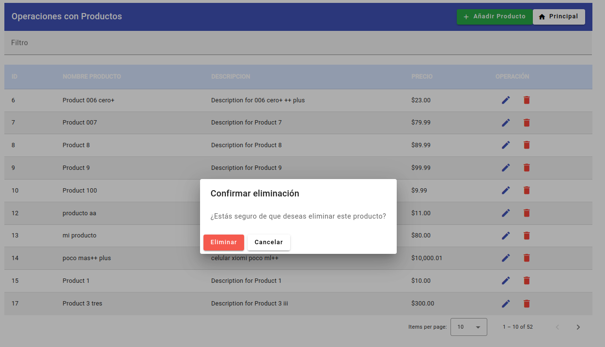

# CRUD Aplicacion sobre Producto con res api   y angular coapra
## Operaciones: Adicion, modificacion, eliminacion y busqueda,

### Descripcion

Este proyecto implementa operaciones CRUD completas (Crear, Leer, Actualizar y Eliminar), junto con filtrado y paginación en un grid. A continuación, se describen las funcionalidades principales:

*Operaciones CRUD y Filtrado: Todas las operaciones de CRUD y filtrado son completamente funcionales.

*Grid con Filtros: El grid permite filtrar datos por todos los campos.

*Ajuste de Columnas: Es posible cambiar el ancho de las columnas en el grid.

*Paginación: El grid incluye paginación y permite seleccionar el número de elementos por página (10, 20, etc.).

*Función de Limpiar Filtro: Actualmente, la función para limpiar el campo de filtro no está implementado **.

### Requisitos del Sistema

- **Sistema Operativo**: Ubuntu 22.04.4 LTS
- **Kernel**: Version 6.2.16-3-pve
- **Angular**: 15.0.4 
- **NodeJS**:  18.20.4
- **npm/npx**: 18.20.4

Sistemas Alternativos Probados

El proyecto también ha sido probado en el siguiente entorno alternativo:

- **Sistema Operativo**: Windows 10 Pro 1803
- **Angular**: 15.0.4 
- **NodeJS**:  18.20.4
- **npm/npx**: 18.20.4

# Fuente

Este proyecto fue basado extraido y adecuado de  [Angular CLI](https://github.com/angular/angular-cli) 

Video de referencia: https://www.youtube.com/watch?v=4mKY_yDq64g

## Notas de instalacion
Crear la aplicación en Angular.

Ejecuta ng serve para un servidor de desarrollo. 

Navega a http://localhost:4200/. 

La aplicación se recargará automáticamente si cambias alguno de los archivos fuente.

Instala Angular Material:

ng add @angular/material

ng serve

Inicia la aplicación en un host y puerto específicos:

ng serve --host 0.0.0.0 --port 4201

En el archivo angular-crud-app/src/app/services/employee.service.ts, cambia la URL de http://localhost:3000/employees a la URL del servidor RESTful API.

El servidor RESTful API en http://192.168.1.10/aprod tiene las siguientes características:

## Imagenes

Busqueda:

Adición:

Modificación:

Eliminación:

## Comandos utiles
*Ver la versión del kernel:

uname -r

*Ver información del sistema:

sb_release -a

Ver la versión de Angular CLI:

ng version

Ver las versiones de Node.js, npm y npx:

node -v && npm -v && npx -v && ng version

